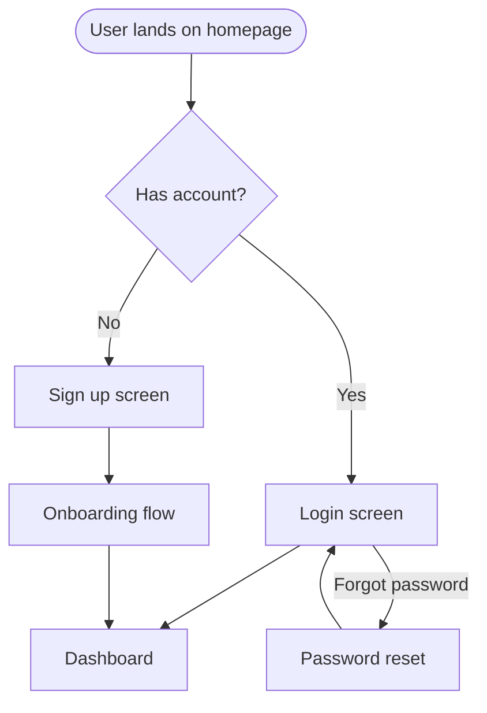

## Overview

This skill produces two primary artifacts: a **journey map** that captures the human side of an experience (stages, emotions, and pain points), and a **flow diagram** that captures the structural side (decision points, screens, and actions). Together they give a complete picture of what a user goes through — and where the design can do better.

---

## Output Format Selection

**Before producing any output**, ask the user which format they want via `AskUserQuestion`:

> "How would you like the user journey delivered? Pick one or more:
>
> 1. **Markdown table** — journey map as a readable `.md` file (good for docs and PRs)
> 2. **Mermaid diagram** — flow diagram as a `.mermaid` file (renders in GitHub, Notion, VS Code)
> 3. **ASCII flow** — plain-text diagram readable in any terminal or editor
> 4. **All of the above**
>
> Default is **1 + 2** if you'd like to skip this."

Use the answer to determine which artifacts to generate and save (see [File Output](#file-output) below).

---

## Journey Map

### Structure

A journey map is a markdown table organized by stage (columns) and the following rows:

| Row | Description |
|---|---|
| **Stage** | The phase of the experience (e.g., Awareness → Consideration → Onboarding → First Use → Habit → Advocacy) |
| **User Actions** | What the user is actively doing at this stage |
| **Thoughts** | What's going through their mind — questions, assumptions, expectations |
| **Emotions** | How they feel: Excited / Neutral / Frustrated / Confused / Delighted |
| **Pain Points** | What's going wrong, creating friction, or failing to meet expectations |
| **Opportunities** | Design improvements that could resolve the pain or elevate the experience |

### Process

1. **Identify the persona and goal.** Who is the user, and what are they trying to accomplish? Anchor the map to one primary persona and one primary goal.
2. **Define the stages.** Adapt the default stage names to the product context. A B2B SaaS product has different stages than a consumer app.
3. **Fill each row for each stage.** Work left to right, populating the table column by column. Be specific — avoid generic filler.
4. **Highlight the critical moments.** After the table is complete, identify the **top 3 pain points** with the highest impact and the top 3 opportunities most worth pursuing.

   A **critical moment** is a touchpoint where failure causes drop-off, frustration, or abandonment. Identify it by frequency × impact on retention. When in doubt: if the user cannot complete their primary job at this touchpoint, it is critical.

   **Specific vs. generic entry:**
   - ✅ Specific: "User searches for 'payroll run' but finds it buried under Settings > Payroll > Run — expects it on the dashboard"
   - ❌ Generic: "User is confused"

   Keep entries specific enough that a designer can act on them directly.

### Output

Produce the journey map as a markdown table:

```markdown
| | Awareness | Consideration | Onboarding | First Use | Habit | Advocacy |
|---|---|---|---|---|---|---|
| **User Actions** | | | | | | |
| **Thoughts** | | | | | | |
| **Emotions** | | | | | | |
| **Pain Points** | | | | | | |
| **Opportunities** | | | | | | |
```

---

## User Flow Diagram

Use Mermaid `flowchart TD` syntax to render the flow.

### Node Conventions

| Shape | Syntax | Use for |
|---|---|---|
| Rectangle | `[Action]` | User actions, screens, or pages |
| Diamond | `{Decision}` | Decision points with Yes/No branches |
| Rounded rectangle | `(State)` | System states or automated steps |
| Stadium | `([Terminal])` | Start and end points |

Arrow labels clarify branch conditions: `-->|Yes|`, `-->|No|`, `-->|Error|`.

### Example Skeleton



### Process

1. **Identify the start state and end goal.** The flow should have a clear entry point and a clear success terminal.
2. **Map the happy path first.** Get the primary success path down before adding branches.
3. **Add decision branches.** Every `{Decision}` node should have at least two labeled exits.
4. **Add error and edge cases.** What happens when something fails? Where does the user land?
5. **Keep to 1 screen = 1 node.** Don't bundle multiple screens into one node; keep the diagram honest. Branches always get a diamond decision node. Abandoned paths (user gives up or exits) get a terminal node labeled `Drop-off: [reason]` — e.g., `Drop-off: password reset too complex`.

---

## Touchpoint Mapping

For each major touchpoint, document the following:

| Attribute | Description |
|---|---|
| **Channel** | Where the interaction happens: web, mobile (iOS/Android), email, push notification, in-app message, SMS, support |
| **Interaction type** | Passive (user receives) vs. Active (user initiates); Read vs. Write |
| **Moment that matters** | High-stakes moments where the experience must be excellent — failure here causes drop-off or trust loss |

Focus on the touchpoints that are load-bearing: where the user makes a commitment, forms an impression, or decides to continue or leave.

---

## Output Format

Produce the artifacts the user selected, in this order:

1. **Journey Map table** — full markdown table covering all stages and rows *(always included)*
2. **User Flow diagram** — Mermaid `flowchart TD` code block showing the full flow with decision branches *(if Mermaid or All selected)*
3. **ASCII flow** — plain-text diagram of the happy path + key branches *(if ASCII or All selected)*
4. **Touchpoint summary** — a brief list of key touchpoints with channel and interaction type for each *(always included)*
5. **Top 3 design recommendations** — concrete, prioritized recommendations derived directly from the **top 3 pain points** identified in the map. Each recommendation names the pain point it resolves. *(always included)*

---

## File Output

Save all generated artifacts to `skills/user-journey/outputs/<feature-name>/`. Use the product or feature name from the brief (kebab-case). Create the directory if it doesn't exist.

| Format selected | File saved |
|---|---|
| Markdown table | `<feature-name>-journey-map.md` |
| Mermaid diagram | `<feature-name>-flow.mermaid` |
| ASCII flow | `<feature-name>-flow.txt` |

**Markdown file structure** (when saving `.md`):

```markdown
# User Journey — [Feature Name]

> Generated: [date] · Format: [selected format(s)]

## Journey Map
[table]

## Touchpoint Summary
[list]

## Top 3 Design Recommendations
[recommendations]
```

**Mermaid file** (`.mermaid`) — raw Mermaid syntax only, no markdown wrapper. Renders directly in GitHub, Notion, VS Code Mermaid extension.

**ASCII file** (`.txt`) — plain text, no markdown. Use `+`, `-`, `|`, `>`, `v` characters. Example:

```
[Start] --> [Screen A] --> {Decision?}
                               |Yes        |No
                               v           v
                          [Screen B]   [Screen C]
                               |
                               v
                            [End]
```

After saving, tell the user:
> "Saved to `skills/user-journey/outputs/<feature-name>/`. Open the `.mermaid` file in VS Code (with the Mermaid extension) or paste it into [mermaid.live](https://mermaid.live) to preview the flow."
